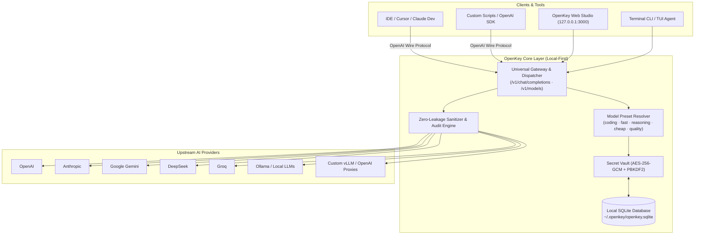

<div align="center">

# OpenKey

### Universal AI Layer · Local-First Model Gateway · Cryptographic Secret Vault

[](LICENSE)
[](https://nodejs.org)
[](https://www.typescriptlang.org)
[](https://csrc.nist.gov)
[](https://github.com/MateoHdzC/openkey)

<p align="center">
  <strong>OpenKey</strong> is a high-performance, local-first gateway that unifies AI provider management, transparent model routing, and zero-leakage cryptographic storage for modern development workflows.
</p>

[Key Features](#-key-features) • [Architecture](#-architecture) • [Getting Started](#-getting-started) • [Proxy Integration](#-universal-proxy-api) • [Web Studio](#-enterprise-web-studio) • [CLI & Commands](#-command-line-interface) • [Security](#-security-and-confidentiality)

---

</div>

## 🌟 Key Features

- **🌐 Universal OpenAI-Compatible Gateway (`/v1`)**: Exposes standard `POST /v1/chat/completions` and `GET /v1/models` endpoints. Connect Cursor, Claude Dev, OpenWebUI, LangChain, or custom scripts seamlessly.
- **⚡ Transparent Model Presets**: High-level semantic aliases (`coding`, `fast`, `reasoning`, `cheap`, `quality`) that dynamically route to optimal models while explicitly displaying the underlying provider and model ID.
- **🛡️ Zero Silent Fallback**: Complete execution determinism. If an upstream provider fails (rate limits, context errors, auth drops), OpenKey surfaces explicit error telemetry with instant recovery actions (`Retry`, `Switch Model`).
- **📁 Multi-Provider Profiles**: Save multiple distinct configurations per provider (e.g. *OpenAI - Personal*, *OpenAI - Enterprise*, *Local vLLM / Ollama Cluster*) with custom base URLs, custom headers, and dedicated credentials.
- **🔐 Machine-Scoped Cryptographic Vault**: AES-256-GCM encrypted storage backed by native SQLite (`~/.openkey/openkey.sqlite`). Master keys are derived on-device with PBKDF2 (100,000 iterations HMAC-SHA512).
- **🖥️ Synchronized Web Studio & Terminal TUI**: Real-time streaming conversation workspace, side-by-side model comparison matrix, Command Palette (`Ctrl+K`), in-chat live model switching, and offline token/cost analytics.
- **📦 Password-Protected Vault Portability**: Seamlessly export and import encrypted backup archives with custom passwords across machines.

---

## 🏛️ Architecture



---

## ⚡ Model Presets Matrix

OpenKey bridges high-level intent with concrete model execution:

| Preset Alias | Primary Provider | Default Model Target | Optimization Focus |
|---|---|---|---|
| `⚡ fast` | **Groq** | `llama-3.3-70b-versatile` | Ultra-low latency, real-time responses |
| `💻 coding` | **DeepSeek** | `deepseek-chat` | Full-stack development, refactoring, code review |
| `🧠 reasoning` | **OpenAI** | `o1-mini` | Deep logic, math, multi-stage planning |
| `💰 cheap` | **Google Gemini** | `gemini-1.5-flash` | High context window with minimum token expense |
| `🎯 quality` | **Anthropic** | `claude-3-7-sonnet-latest` | Maximum nuance, safety, instruction adherence |

*Presets can be customized or pointed to any available model.*

---

## 🚀 Getting Started

### Prerequisites
- **Node.js**: `v20.0.0+` or `v24.0.0+` (uses native `node:sqlite`)
- **Package Manager**: `npm`, `pnpm`, or `yarn`

### Installation & Build

```bash
# 1. Clone the repository
git clone https://github.com/MateoHdzC/openkey.git
cd openkey

# 2. Install dependencies & compile TypeScript
npm install
npm run build

# 3. Link globally
npm link
```

---

## 🌐 Universal Proxy API

Connect any OpenAI-compatible client by pointing its base URL to OpenKey:

```
Base URL: http://127.0.0.1:3000/v1
API Key:  [Any string, e.g. "openkey-local"]
```

### Supported Routes
- `POST /v1/chat/completions` — Streaming (SSE) and buffered chat completion.
- `GET /v1/models` — Discovered models, configured providers, and preset aliases.

### Example: cURL Integration
```bash
curl http://127.0.0.1:3000/v1/chat/completions \
  -H "Content-Type: application/json" \
  -H "Authorization: Bearer local" \
  -d '{
    "model": "coding",
    "messages": [
      { "role": "system", "content": "You are a senior software architect." },
      { "role": "user", "content": "Explain Clean Architecture with a concrete diagram." }
    ],
    "stream": false
  }'
```

### Example: Python OpenAI SDK
```python
import os
from openai import OpenAI

client = OpenAI(
    base_url="http://127.0.0.1:3000/v1",
    api_key=os.environ.get("OPENKEY_API_KEY", "openkey-local")
)

response = client.chat.completions.create(
    model="coding", # Or "anthropic/claude-3-7-sonnet", "deepseek-chat", etc.
    messages=[{"role": "user", "content": "Write an async worker in TypeScript."}]
)

print(response.choices[0].message.content)
```

---

## 🖥️ Enterprise Web Studio

Run the standalone Web Studio on your local machine:

```bash
openkey web --port 3000
```

Open `http://127.0.0.1:3000` in your browser.

<div align="center">
  <sub>Dark / OLED Theme (<code>#05070A</code>) with Electric Blue (<code>#2F7CFF</code>) accents</sub>
</div>

### Studio Capabilities:
- **In-Chat Instant Model Switcher**: Change from DeepSeek to Claude mid-chat without losing conversation context or history.
- **Model Comparison Matrix (`/compare`)**: Parallel evaluation of multiple models against the same prompt with latency, token usage, and cost indicators.
- **Command Palette (`Ctrl+K` / `⌘K`)**: Jump between views, trigger diagnostics, or change workspaces instantly.
- **Context & Secret Manager**: Inspect project directory context with automatic secret exclusion (`.env`, `.pem`, `.git`).
- **Telemetry & Cost Dashboard**: Visual analytics by provider, request frequency, and estimated USD expenditure.

---

## 💻 Command Line Interface

```bash
# Launch interactive Terminal Agent & background Web Studio
openkey

# Start dedicated Universal OpenAI Proxy
openkey proxy --port 3000

# Launch standalone Web Studio
openkey web --port 3000

# Interactive credential & provider manager
openkey connect

# List and inspect configured model presets
openkey presets

# List and manage provider profiles
openkey profiles

# List project workspaces
openkey workspaces

# Export encrypted backup archive
openkey export --output backup.json --password "YourMasterPassword"

# Import and restore encrypted backup
openkey import backup.json --password "YourMasterPassword"

# Real-time token consumption statistics
openkey usage

# Diagnostic health check (Crypto, Database, Connectivity)
openkey doctor

# Check repository updates & automatic upgrade
openkey update
```

---

## 🔒 Security and Confidentiality

1. **Local-First Isolation**: Zero telemetry or conversation payload is transmitted to third-party servers. All data remains exclusively on `127.0.0.1`.
2. **Cryptographic Key Storage**:
   - Master seed derived using PBKDF2 (100,000 iterations HMAC-SHA512) bound to local host identities.
   - Individual secrets encrypted via AES-256-GCM with unique 16-byte salts, 12-byte IVs, and 16-byte authentication tags.
3. **Execution Guardrails**: Terminal tool executions containing destructive operations require explicit user approval via confirmation prompts.
4. **Sanitization Filter**: Memory streams and log pipelines automatically mask API keys and authorization headers to avoid accidental exposure in debug logs.

---

## 🧪 Testing

Execute the test suite with Vitest:

```bash
npm test
```

---

##  License

Distributed under the **MIT License**. See `LICENSE` for more information.

Copyright © 2026 [MateoHdzC](https://github.com/MateoHdzC/openkey).


